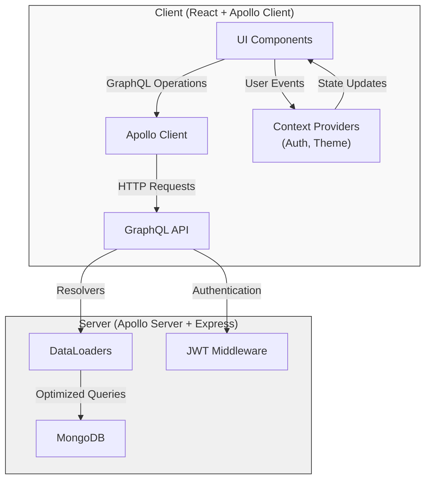
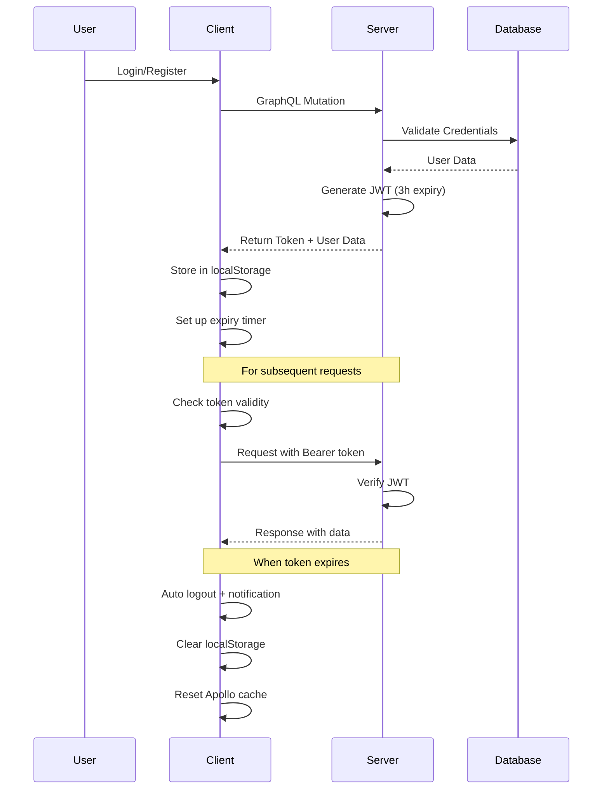
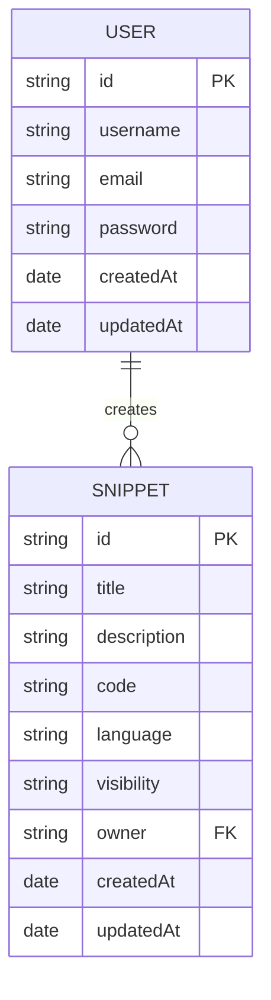

# Snippet Store

A full-stack application for storing, searching, and sharing code snippets with syntax highlighting. Built with React, Apollo Client, GraphQL, Apollo Server, Express, and MongoDB.

## Features

- 🔒 **User Authentication**: Secure JWT-based authentication with automatic token expiration handling
- 📝 **Snippet Management**: Create, view, and delete code snippets
- 🔍 **Search Functionality**: Search snippets by title, description, or code content
- 🌓 **Theme Switching**: Toggle between light and dark themes
- 📱 **Responsive Design**: Works on desktop and mobile devices
- 🚀 **Pagination**: Efficient loading of snippets with cursor-based pagination
- 🔄 **Real-time Updates**: Apollo cache updates for a seamless user experience

## Architecture



## Authentication Flow



## Project Structure

```
snippet-store/
├── client/                  # React frontend
│   ├── src/
│   │   ├── apollo/          # Apollo Client setup and GraphQL operations
│   │   ├── components/       # Reusable UI components
│   │   ├── context/          # React Context providers
│   │   ├── layouts/          # Page layout components
│   │   ├── pages/            # Page components
│   │   └── styles/           # CSS and theme files
│   ├── index.html            # HTML entry point
│   └── package.json          # Frontend dependencies
│
└── server/                  # Express + Apollo Server backend
    ├── src/
    │   ├── config/           # Database configuration
    │   ├── graphql/          # GraphQL schema and resolvers
    │   │   ├── resolvers/    # Query and mutation resolvers
    │   │   └── typeDefs/     # GraphQL type definitions
    │   ├── loaders/          # DataLoader implementations
    │   ├── middlewares/      # Express middlewares
    │   ├── models/           # Mongoose models
    │   └── index.js          # Server entry point
    └── package.json          # Backend dependencies
```

## Data Models



## Getting Started

### Prerequisites

- Node.js (v14+)
- MongoDB

### Installation

1. Clone the repository
   ```bash
   git clone https://github.com/BasithDev/snippet-store.git
   cd snippet-store
   ```

2. Install server dependencies
   ```bash
   cd server
   npm install
   ```

3. Create a `.env` file in the server directory with the following variables:
   ```
   MONGODB_URI=mongodb://localhost:27017/snippet-store
   JWT_SECRET=your_jwt_secret_key
   PORT=4000
   ```

4. Install client dependencies
   ```bash
   cd ../client
   npm install
   ```

### Running the Application

1. Start the server
   ```bash
   cd server
   npm start
   ```

2. Start the client
   ```bash
   cd client
   npm run dev
   ```

3. Open your browser and navigate to `http://localhost:5173`

## Key Features Implementation

### JWT Token Expiration Handling

The application implements robust JWT token expiration handling:

- Tokens are set to expire after 3 hours on the server
- Client-side validation prevents using expired tokens
- Automatic logout when token expires with user notification
- Token validation before adding to request headers

### Apollo Client Cache Management

Efficient data management with Apollo Client:

- Custom cache policies for pagination
- Optimistic UI updates for mutations
- Cache normalization for consistent data

### DataLoader Implementation

Performance optimization with DataLoader:

- Batching database queries to reduce roundtrips
- Caching results to prevent duplicate queries
- Efficient resolution of nested relationships

## License

MIT
